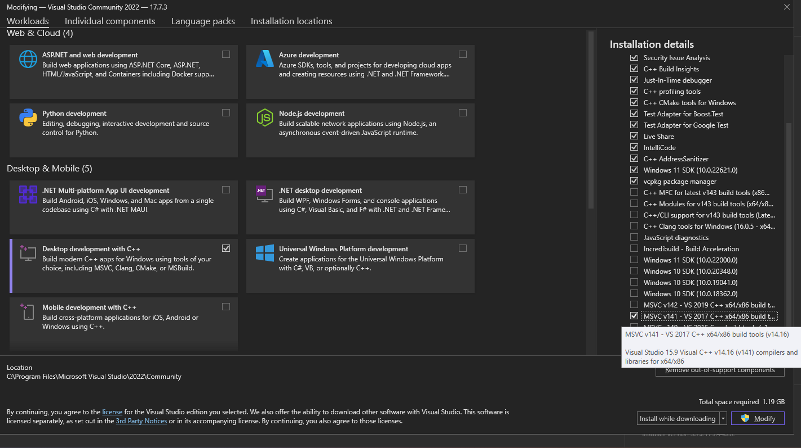

## Shooting Cans

Shooting cans is a First Person Shooting game developed in C++ as an assignment for the 2017 Computer Graphics course.


You can check the project description & requirements [here](CGProject2017.pdf)


## Installation

To install the app first download the source code from github

```bash
git clone https://github.com/nklido/cg-shooting-cans.git
```

Install Visual Studio with `Desktop Development for C++` and `MSVC v141 - VS 2017` build tools selected.



Now you can open the solution file and build the project
